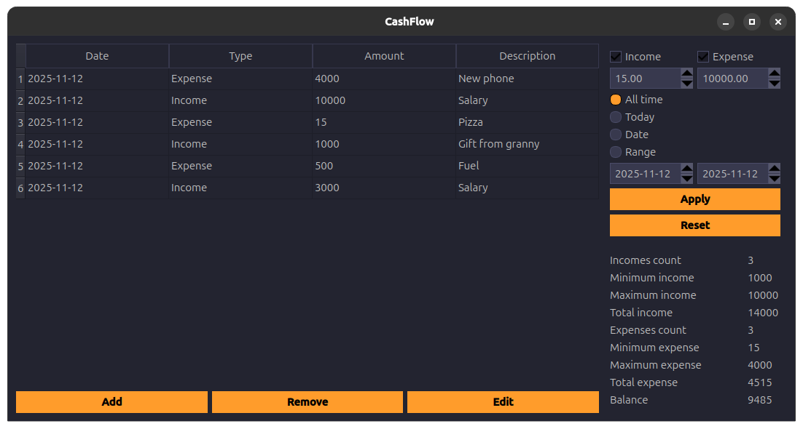

# 💸 CashFlow
A lightweight cross-platform desktop application for tracking income and expenses with a clean, intuitive interface.


## ✨ Features
- 💰 Add, edit, and delete financial transactions
- 🧾 View all transactions in a structured list
- 🔍 Filter by type (income / expense), price range, or date (all time, today, selected day, or period)
- 📊 Generate financial reports for any chosen time frame

## 🖼️ Preview


## 🚀 Technologies
- Language: C++
- Framework: Qt (QtWidgets, QtSql, QtCore)
- Database: SQLite
- Build system: CMake
- Version control: Git

## 🚀 Build and run
```bash
# Clone the repository
git clone https://github.com/mikhailshevtsov/CashFlow.git
cd CashFlow

# Create build directory
mkdir build && cd build

# Configure and build
cmake ..
cmake --build .

# Run the application
./CashFlow
```

## 📜 License
MIT License © 2025 Mikhail Shevtsov
